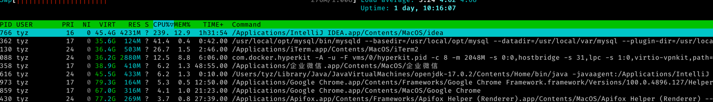

cpu占用 大概43%
单线程
 
大概10000条记录需要十秒的插入时间 巨慢..
不等了

```
19:25:36.629 [main] INFO jdbc.ConnectionPlay - 30000 2022-04-17T19:25:36.629658+08:00[Asia/Shanghai]
19:25:47.073 [main] INFO jdbc.ConnectionPlay - 40000 2022-04-17T19:25:47.073286+08:00[Asia/Shanghai]
19:25:57.757 [main] INFO jdbc.ConnectionPlay - 50000 2022-04-17T19:25:57.757129+08:00[Asia/Shanghai]
19:26:09.759 [main] INFO jdbc.ConnectionPlay - 60000 2022-04-17T19:26:09.759007+08:00[Asia/Shanghai]
19:26:23.222 [main] INFO jdbc.ConnectionPlay - 70000 2022-04-17T19:26:23.222251+08:00[Asia/Shanghai]
19:26:33.514 [main] INFO jdbc.ConnectionPlay - 80000 2022-04-17T19:26:33.514634+08:00[Asia/Shanghai]
19:26:43.835 [main] INFO jdbc.ConnectionPlay - 90000 2022-04-17T19:26:43.835852+08:00[Asia/Shanghai]
19:26:54.106 [main] INFO jdbc.ConnectionPlay - 100000 2022-04-17T19:26:54.106522+08:00[Asia/Shanghai]
19:27:03.930 [main] INFO jdbc.ConnectionPlay - 110000 2022-04-17T19:27:03.930958+08:00[Asia/Shanghai]
```

```
Hardware Overview:

  Model Name:	MacBook Pro
  Model Identifier:	MacBookPro16,1
  Processor Name:	8-Core Intel Core i9
  Processor Speed:	2.4 GHz
  Number of Processors:	1
  Total Number of Cores:	8
  L2 Cache (per Core):	256 KB
  L3 Cache:	16 MB
  Hyper-Threading Technology:	Enabled
  Memory:	32 GB
  System Firmware Version:	1731.100.130.0.0 (iBridge: 19.16.14243.0.0,0)
  OS Loader Version:	540.100.7~23
  Serial Number (system):	C02ZX2JAMD6T
  Hardware UUID:	7DC3CF8F-9579-5C96-9943-B0638E70CD93
  Provisioning UDID:	7DC3CF8F-9579-5C96-9943-B0638E70CD93
  Activation Lock Status:	Enabled

```